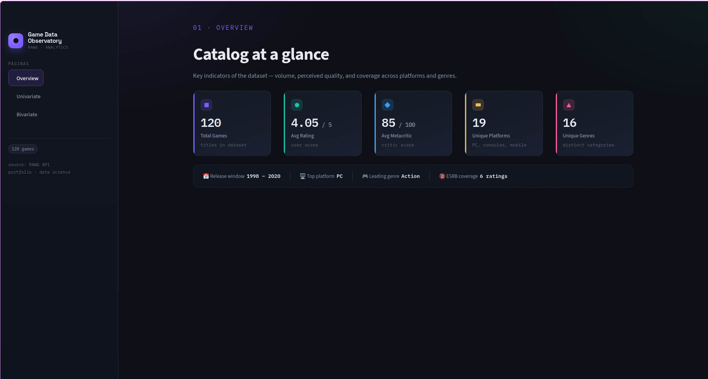
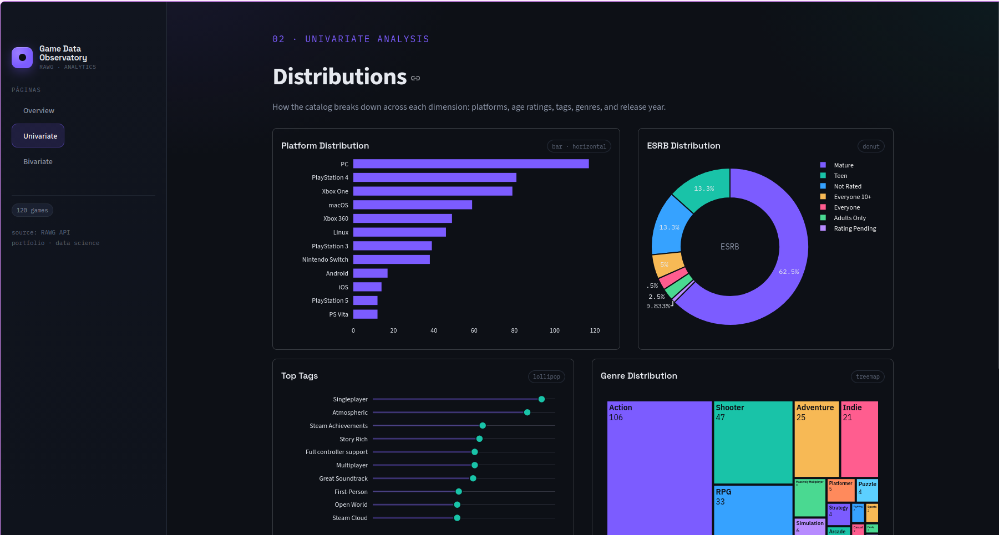
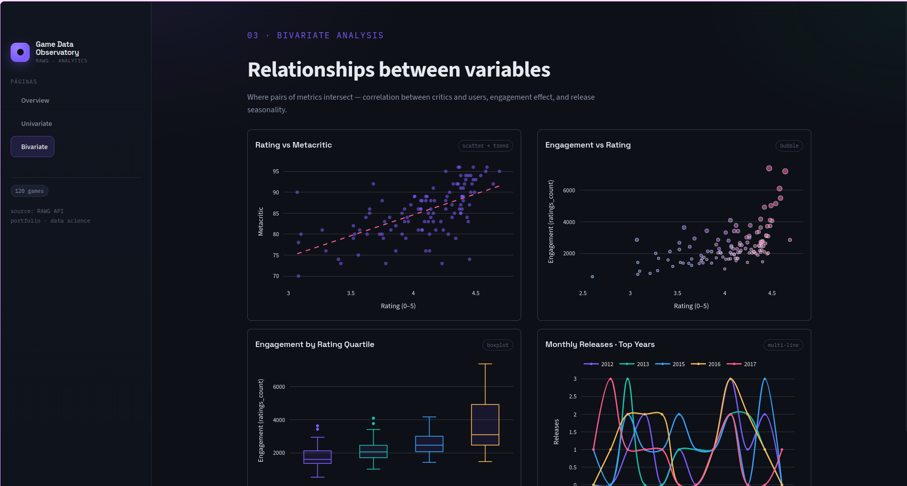

# 🎮 Game Data Observatory

> An end-to-end data analytics application built on top of the RAWG Video Games API — from data collection to an interactive dashboard, with a clean layered architecture throughout.

---

## 📸 Preview

<!-- Add a screenshot of your dashboard here -->




---

## 🧭 Architecture

```
RAWG API
   ↓
Data Collection Layer
   ↓
MySQL Database
   ↓
Database Query Layer
   ↓
Analytics Service Layer  (Pandas)
   ↓
FastAPI Backend
   ↓
Streamlit Dashboard
```

Each layer has a single responsibility and communicates only with the layer directly above or below it.

---

## 🗂️ Project Structure

```
game_data_observatory/
├── backend/
│   ├── api/
│   │   ├── rawg_client.py       # RAWG API data collection
│   │   └── routes.py            # FastAPI endpoints
│   ├── database/
│   │   ├── connection.py        # MySQL connection
│   │   ├── insert_games.py      # Data insertion
│   │   └── queries/
│   │       └── games_queries.py # Query functions
│   ├── services/
│   │   └── analytics_service.py # Pandas analytics layer
│   ├── schemas/
│   │   └── game.py              # Pydantic models
│   ├── config.py                # Environment variables
│   └── main.py                  # FastAPI app entry point
├── frontend/
│   ├── app.py                   # Streamlit entry point
│   ├── theme.py                 # Design tokens + Plotly template
│   ├── style.css                # Dark theme stylesheet
│   ├── .streamlit/
│   │   └── config.toml
│   └── views/
│       ├── overview.py          # Page 01 · KPI cards
│       ├── univariate.py        # Page 02 · distributions
│       ├── bivariate.py         # Page 03 · relationships
│       └── _data.py             # Shared data helpers
├── tests/
│   └── test_analytics_service.py
├── eda/
│   └── Games EDA.ipynb
├── conftest.py
└── requirements.txt
```

---

## 🚀 Tech Stack

| Layer | Technology |
|---|---|
| Data Collection | Python, Requests, RAWG API |
| Database | MySQL, mysql-connector-python |
| Analytics | Pandas, NumPy |
| Backend | FastAPI, Pydantic, Uvicorn |
| Frontend | Streamlit, Plotly |
| Testing | Pytest, unittest.mock |
| Config | python-dotenv |

---

## 📊 Dataset

- **120 games** collected from the RAWG API
- Fields: `id`, `name`, `released`, `rating`, `ratings_count`, `metacritic`, `genres`, `platforms`, `tags`, `esrb_rating`

---

## 📡 API Endpoints

### Games
| Method | Endpoint | Description |
|---|---|---|
| GET | `/games` | List all games |
| GET | `/games/{game_id}` | Get game by ID |
| GET | `/games/top-rated` | Top rated games (param: `limit`) |
| GET | `/games/most-engaged` | Most engaged games (param: `limit`) |

### Analytics
| Method | Endpoint | Description |
|---|---|---|
| GET | `/analytics/summary` | Key metrics summary |
| GET | `/analytics/platforms` | Platform distribution |
| GET | `/analytics/esrb` | ESRB rating distribution |
| GET | `/analytics/tags` | Top tags |
| GET | `/analytics/genres` | Genre distribution |
| GET | `/analytics/years` | Release year distribution |
| GET | `/analytics/rating-metacritic` | Rating vs Metacritic data |
| GET | `/analytics/engagement-rating` | Engagement vs Rating data |
| GET | `/analytics/engagement-quartiles` | Engagement by rating quartile |
| GET | `/analytics/monthly-releases-top-years` | Monthly releases for top years |

Interactive documentation available at `http://127.0.0.1:8000/docs` (Swagger UI).

---

## 🖥️ Dashboard Pages

**01 · Overview**
Five KPI cards (total games, avg rating, avg metacritic, unique platforms, unique genres) plus a highlights strip with release window, top platform, and leading genre.

**02 · Univariate Analysis**
Platform distribution (horizontal bar), ESRB distribution (donut), top tags (lollipop), genre distribution (treemap), and release year distribution (histogram).

**03 · Bivariate Analysis**
Rating vs Metacritic (scatter + trendline), Engagement vs Rating (bubble chart), Engagement by Rating Quartile (boxplot), and Monthly Releases for Top Years (multi-line chart).

---

## ⚙️ Setup

### 1. Clone the repository

```bash
git clone https://github.com/your-username/game_data_observatory.git
cd game_data_observatory
```

### 2. Create and activate virtual environment

```bash
python -m venv env
source env/bin/activate  # Windows: env\Scripts\activate
```

### 3. Install dependencies

```bash
pip install -r requirements.txt
```

### 4. Configure environment variables

Create a `.env` file in the project root:

```env
RAWG_API_KEY=your_rawg_api_key
MYSQL_HOST=localhost
MYSQL_USER=your_mysql_user
MYSQL_PASSWORD=your_mysql_password
MYSQL_DATABASE=your_database_name
```

### 5. Set up the database

Create the database and run the data collection script to populate it.

### 6. Run the FastAPI backend

```bash
uvicorn backend.main:app --reload
```

API will be available at `http://127.0.0.1:8000`

### 7. Run the Streamlit dashboard

Open a second terminal:

```bash
cd frontend
streamlit run app.py
```

Dashboard will open at `http://localhost:8501`

---

## 🧪 Running Tests

```bash
pytest tests/test_analytics_service.py -v
```

Tests cover all analytics functions using mocked data — no database connection required.

---

## 📝 Logging

The application logs to both the console and `app.log` file, covering three layers:

- **Database layer** — query execution and record counts
- **Analytics layer** — DataFrame operations and transformation steps
- **API layer** — endpoint calls and response status

---

## 🔑 Getting a RAWG API Key

1. Create a free account at [rawg.io](https://rawg.io/apidocs)
2. Generate your API key in the dashboard
3. Add it to your `.env` file

---

## 👤 Author

**Pedro Cella**
Data Science & Analytics Portfolio Project

[](https://linkedin.com/in/pedro-cella)
[](https://github.com/pedro-cella)